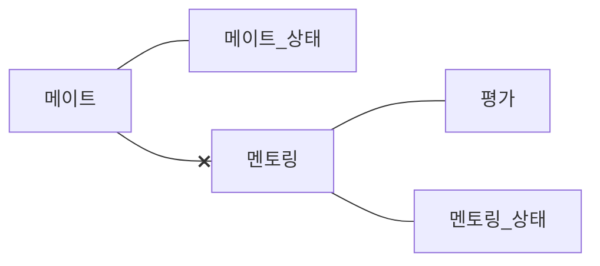

### 메이트
- 메이트는 다음 중 하나의 상태를 갖는다.
  - 요청, 수락, 거절, 취소
  - 메이트가 수락 상태일 때 멘티와 멘토 모두 도중 취소할 수 있다.
- 멘토링이 다음 중 하나의 상태인 경우 취소가 불가능 하다.
  - 요청, 수락, 확정

### 멘토링
- 멘토링은 다음 중 하나의 상태를 갖는다.
  - 요청, 수락, 확정, 완료, 취소
  - 멘토링이 확정되면 취소가 불가능 하다.
- 멘토링은 메이트 관계가 아니면 생성할 수 없다.
- 멘티가 멘토링을 확정 하려면 계좌에 지불 금액이 있어야 한다.
  - 멘토링 확정시에 멘티의 계좌에서 지불 금액이 차감된다.
- 멘토링은 시작해서 당일안에 끝나야 한다.
  - 멘토링 시간은 1 ~ 15시간 사이에서 선택해야 한다.
- 멘티가 멘토링에 평가를 등록할 수 있다.
  - 완료 상태가 아니면 등록할 수 없다.

## 모델링
### 메이트

### 메이트
- [x] 메이트는 식별자, 상태를 갖는다.
- 메이트는 다음 중 하나의 상태를 갖는다.
  - 요청, 수락, 거절, 취소
  - [x] 메이트는 최초에 요청 상태를 갖는다.
  - [x] 메이트를 수락하면 상태를 수락으로 변경한다.
    - [x] 메이트가 요청 상태가 아니면 수락할 수 없다.
  - [x] 메이트를 거절하면 상태를 거절로 변경한다.
    - [x] 메이트가 요청 상태가 아니면 거절할 수 없다.
  - [x] 메이트를 취소하면 상태를 취소로 변경한다.
    - [x] 메이트가 수락 상태가 아니면 취소할 수 없다.
    - [x] 멘토링이 요청, 수락, 확정, 완료 상태인 경우 취소할 수 없다.

### 멘토링
- [x] 멘토링은 식별자, 상태, 시작 시각, 멘토링 시간, 평가를 갖는다. 
- 멘토링은 다음 중 하나의 멘토링 상태를 갖는다.
  - 요청, 수락, 확정, 완료, 취소
  - [x] 멘토링은 최초에 요청 상태를 갖는다.
  - [x] 멘토링을 수락하면 상태를 수락으로 변경한다.
  - [x] 멘토링을 확정하면 상태를 확정으로 변경한다.
  - [x] 멘토링을 완료하면 상태를 완료로 변경한다.
  - [x] 멘토링을 취소하면 상태를 취소로 변경한다.
- [x] 평가를 등록한다.
  - [x] 멘토링이 완료 상태가 아니면 평가를 등록할 수 없다.

### 멘토링 시간
- [x] 멘토링은 1이상 ~ 15이하의 시간으로 진행되어야 한다.
- [x] 멘토링 시작 시간과 멘토링 시간의 합은 자정을 초과할 수 없다.

### 멘토링 상태 검증
- [x] 멘토링은 메이트가 수락 상태가 아니면 생성할 수 없다.
- [x] 멘토링이 요청 상태가 아니면 수락할 수 없다.
- [x] 멘토링이 수락 상태가 아니면 확정할 수 없다.
- [x] 멘토링이 확정 상태가 아니면 완료할 수 없다.
- [x] 멘토링이 요청이나 수락 상태가 아니면 취소할 수 없다.

### 멘토링 평가
- [x] 멘토링 평가는 식별자, 점수, 리뷰를 갖는다.
- [x] 멘토링 점수는 0미만 이거나 5초과면 등록할 수 없다.

### 계좌 잔액 검증
- [ ] 멘티의 계좌에 잔액이 지불금액보다 작으면 멘토링을 확정할 수 없다.
